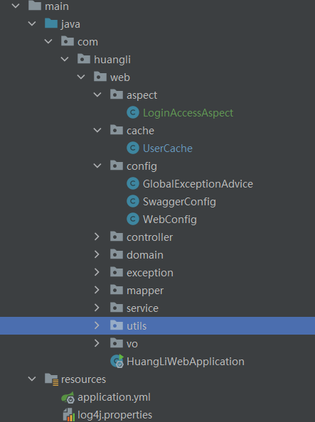

# 项目结构
项目分为三个文件夹，分别为:

- huangli-test-web: 测试的后端
- vue-element-admin： 测试的前端
- shell：测试的两个shell题目

### 前端结构

由于前端使用vue-element-admin框架，仅在views中添加了emp文件夹与响应的api文件，暂且不说

### 后端结构

后端结构如下：

- aspect：简单登录权限校验
- cache：为登录缓存，未引入缓存中间价，所以暂且使用map作为登录用户的缓存
- config：一些springboot、swagger、全局异常处理器等的配置类
- Controller：接口层代码
- domain：实体类代码
- exception：公共业务异常
- mapper：dao层代码
- service：具体的业务代码
- utils：utils类
- vo：前后端交互所用的类

### shell

- test1.sh为第一个shell脚本，查找字符串生成新文件并输出到控制台
- test2.sh为第二个的shell脚本。显示硬盘、cpu、内存的使用

